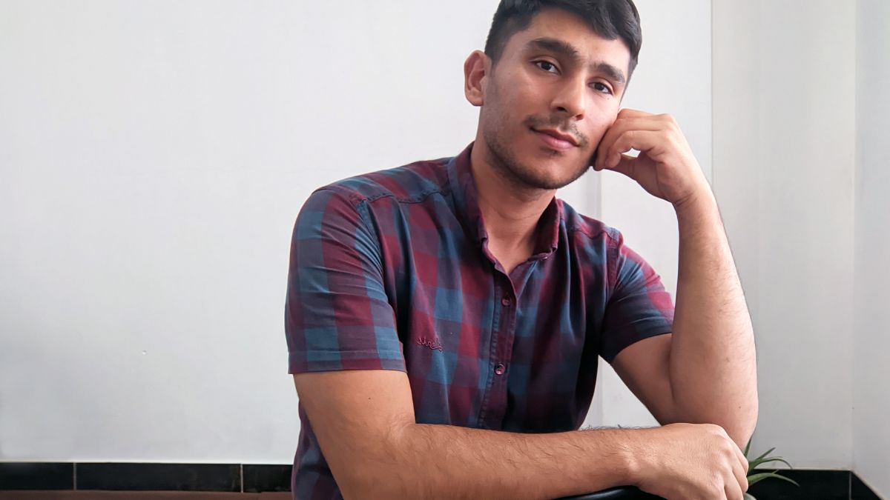

سلام به همه، امیدوارم که خوب و سلامت باشید. 

زکریا شیرمحمدلی هستم، یک معلم زبان انگلیسی بیست و سه ساله از شهر زیبای گنبد کاووس واقع در استان گلستان. توی وقت هایی که به تدریس مشغول نیستم توی این وبسایت درباره موضوعاتی که بهشون علاقه دارم [مطلب می نویسم](https://zachshirow.ir/posts)، برای حل مشکلات مردم [محصولاتی خلق می کنم](https://zachshirow.ir/tags/محصول)، و [خدماتی ارائه می دم](https://zachshirow.ir/tags/خدمت) تا بهتر و سریعتر کسب و کارهاشون رو توسعه بدهند.

موضوعاتی که در موردشون صحبت می کنم، محصول خلق می کنم، و خدمات ارائه می دم مربوط میشن به: 

1) آموزش زبان انگلیسی، 
2) ابزار های بهره وری مثل Notion، Obsidian، و
3) طراحی گرافیک و برنامه نویسی. 

---

## من که هستم؟

توی این مقاله از تحصیلات، تجربه کاری، علاقه و اهدافم باهاتون صحبت میکنم. پس اگه مشتاق هستید که بیشتر در مورد من بدونید با من همراه بشید. 

علاوه بر این، یک ویدیو هم درباره خودم درست کردم که میتونید از لینک زیر اون رو تماشا کنید. 

<!-- [تماشای ویدیو در آپارات](https://www.aparat.com/v/lyqwD) -->

<iframe src="https://www.aparat.com/video/video/embed/videohash/lyqwD/vt/frame"  allowFullScreen="true" webkitallowfullscreen="true" mozallowfullscreen="true"></iframe>
   

رزومه فارسی بنده هم در قالب فایل پی دی اف از طریق لینک زیر قابل دسترسی هست. 
[دریافت فایل PDF رزومه](https://drive.google.com/file/d/1Cr07mlAf6OOB57TTDNYzPg0YS9M1We4c/view?usp=sharing)

## تحصیلات

از بچگی خیلی به زبان انگلیسی علاقه داشتم و بعد تر از دبیرستان به این فکر افتادم که خیلی دوست دارم معلم زبان انگلیسی بشم برای همین توی کنکور زبان شرکت کردم. 

تحصیلات کارشناسی ام رو در رشته آموزش زبان انگلیسی دانشگاه مازندران بابلسر در تیرماه 1401 به اتمام رسوندم. 

توی دوران دانشگاهم خیلی چیزای خوبی در مورد آموزش زبان انگلیسی یاد گرفتم و از اساتید و همکلاسی هام تشکر می کنم که توی این راه به من کمک کردند. 

## سابقه کار

از تجربیات کاریم میتونم به دو مورد اشاره کنم: 

اولیش، دو سالی هست که در کنار تحصیلاتم از 1398 تا 1400 در مدیریت همکاری های علمی و بین المللی دانشگاه مازندران به عنوان کارآموز طراح گرافیک و برنامه نویس مشغول بودم. توی این موقعیت شغلی روی وبسایت و شبکه های اجتماعی این قسمت از دانشگاه کار میکردم. تولید محتوا، طراحی پوستر و بنر، و نگهداری و توسعه وبسایت از کارهایی بود که انجام می دادم. [میتونید توی این پست بیشتر در مورد این تجربه کاریم بخونید.](/posts/work-oisc)

دومیش هم پنج ماهی هست که بعد از فارغ التحصیلی در پاییز و زمستان 1401 به تدریس زبان انگلیسی در زبانکده نوین گنبد کاووس مشغول به کار بودم. این تجربه تدریس خوبی بود. اوایل خیلی استرس داشتم اما با مرور زمان ترس ام ریخت و توی مدیریت کلاس و محتوای آموزشی خیلی چیزها یادگرفتم و بهتر شدم. 

علاوه بر این دو مورد تجربه کاری، در یکسال بعد از فارغ التحصیلی از دانشگاه، به صورت فریلنسری روی پروژه های گرافیک و برنامه نویسی و درست کردن سیستم ها و پروژه ها توی نرم افزار [notion](/posts/notion) فعالیت می کردم. 

در حال حاضر که در شهریور 1402 دارم این مطلب رو می نویسم قرار هست که از مهرماه به عنوان [سربازمعلم](/posts/how-soldier-teacher) با آموزش و پرورش شهرستان گنبد کاووس استان گلستان همکاری داشته باشم. در سه روستای کرند، هوتن، و آق بند زبان انگلیسی رو تدریس خواهم کرد. زمان زیادی برای تدریس صرف نمی کنم و فقط 24 ساعت در هفته هستش. یعنی میتونم از زمان آزادی که دارم برای تولید محتوا و خلق ارزش استفاده کنم.

## علاقه من

من خیلی برای توسعه فردی خودم یعنی اصلاح و بهینه سازی رفتار ها و آموزش برای بهتر شدن تلاش میکنم. 

اینجا میخوام در مورد دوتا روشی که من روی توسعه فردی خودم کار میکنم باهاتون به اشتراک بگذارم. 

**روش اولی** که روی توسعه فردی خودم کار میکنم، بررسی عادت هام و بهبود اونها به مرور زمان هستش. این تلاش من معمولا توی ژورنال هام محقق میشن. یعنی رفتار هام رو در طول تاریخ بررسی می کنم و در طول زمان بهترشون میکنم. 

- یه رفتاری که خیلی موفق بودم توی توسعه اش تو خودم اینه که تقریبا 5 ماهه که با برادرم میریم باشگاه و خیلی توی سلامت ام بهم کمک کرده. 
- رفتار دیگری که در خودم بهینه اش کردم و بیش از یک ساله که دارم انجامش میدم نوشتن ژورنال یا یادداشت روزانه هستش. در واقع همین رفتاره که بهم کمک کرده رفتار های دیگه ام رو بازبینی و اصلاح کنم. 

**روش دوم** توسعه فردیم هم زمانی اتفاق میوفته که چیز جدیدی هم یاد میگیرم. همینطور وقتی که چیزی رو هم به کسی یاد میدم باز هم دارم روی توسعه فردی خودم کار میکنم. 

## اهداف من

به شخصه عمده مشکلات و پروژه هایی که روی اونها تمرکز کرده ام رو به نحو احسنت حل کرده ام و قسمت بزرگی از این کار ها رو مدیون آموزش هایی هستم که به رایگان از اینترنت پیدا میکردم و میدیدم. یوتیوب و سایت https://git.ir دوتا از بهترین ها در آموزش هستند. 

آموزش هایی که میدیدم بیشترشان به زبان انگلیسی بودند. من هم به خاطر اینکه زبان انگلیسیم خوب بود میتونستم بدون مشکلی محتوای اونها رو درک کنم و ازشون استفاده کنم. 

اما در طول این مدت با خودم گفتم که بیشتر افرادی که در ایران هستند شاید زبان انگلیسیشون اونقدری خوب نباشه که از این محتوای آموزشی خیلی عالی بتونند استفاده خوبی داشته باشند. 

برای همین، به قصد اینکه لطفی که بهم شده رو جبران کنم تصمیم گرفتم که به دو روش به شما کمک کنم تا از این محتوای آموزشی ارزشمند استفاده کنید. 

- روش اول این هست که محتوای آموزش زبان انگلیسی تولید کنم تا زبان شما تقویت بشه. این محتوا بیشتر کوتاه و جذاب خواهند بود تا شما از یاد گرفتن زبان خسته نشید. 
- روش دوم هم این هست که توی موضوعاتی که بهشون علاقه دارم محتوای فارسی تولید کنم تا گره ای از مشکل شما باز کنم. 

این وبسایت رو برای این درست کردم که بتونم در مورد به طور عمق به موضوعاتی که علاقه دارم بنویسم و بینشون لینک هایی ایجاد کنم که یادگیری رو برای شما آسان کنم.

شاید براتون سوال باشه که [[چجوری این وبسایت رو با Astro و Obsidian ساختم]]. توی این پست میتونید در موردش بخونید.

در هر حال امیدوارم که بتونیم با کمک همدیگه ارزش خلق کنیم و باعث پیشرفت جامعه بشیم. اگه فکر میکنید که موضوعاتی که در موردشون صحبت میکنم براتون مفید هست میتونید من رو توی شبکه های اجتماعی زیر دنبال کنید تا از انتشار آخرین مطالب با خبر بشید: 

تلگرام
https://t.me/zachshirow_ir

تویتر
https://twitter.com/zachshirow

لینکدین 
https://www.linkedin.com/in/zachshirow
